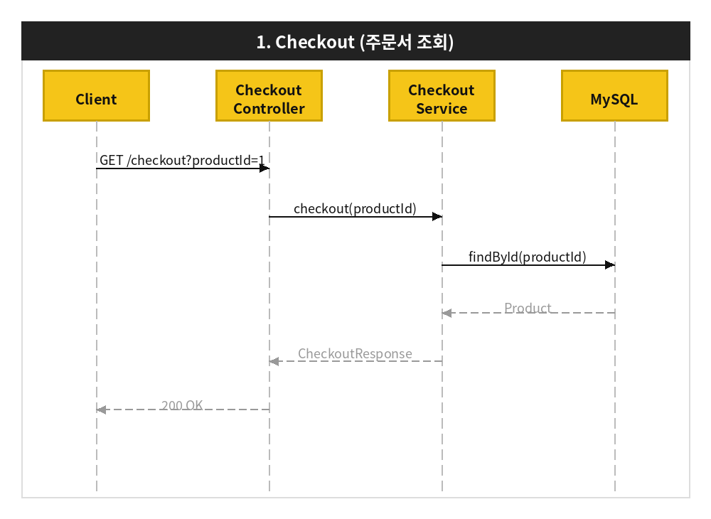
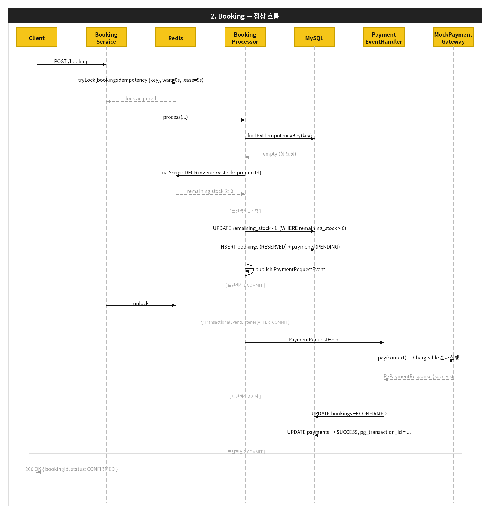
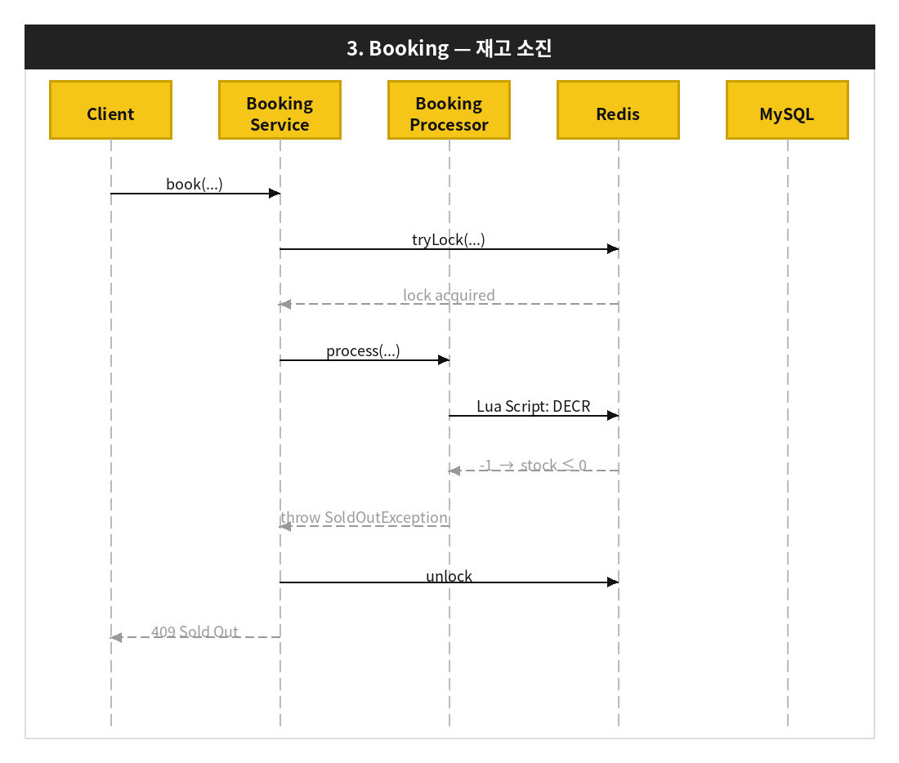
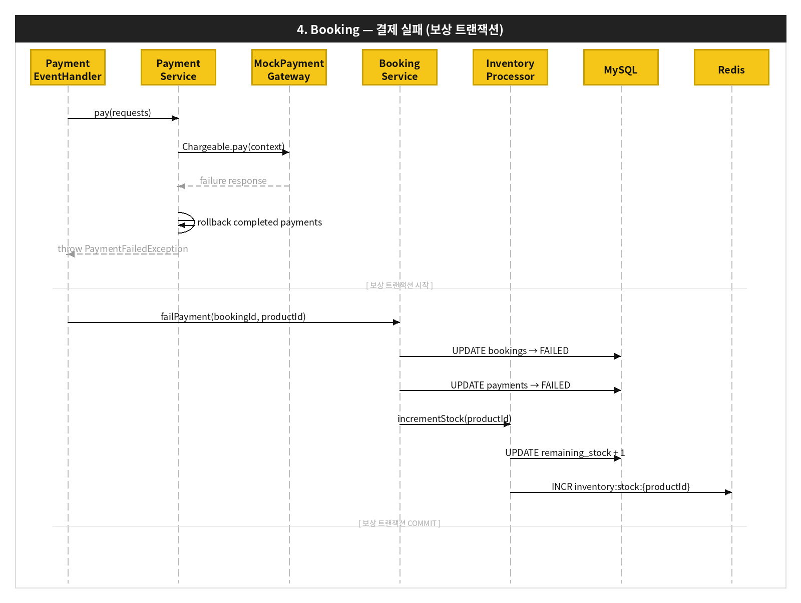
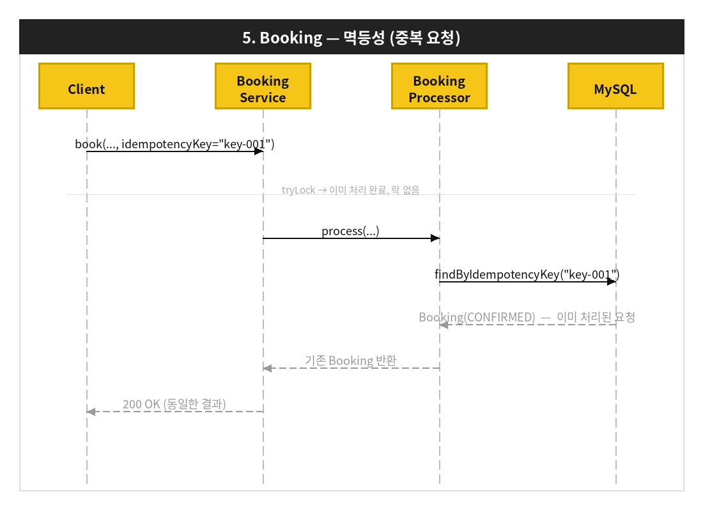
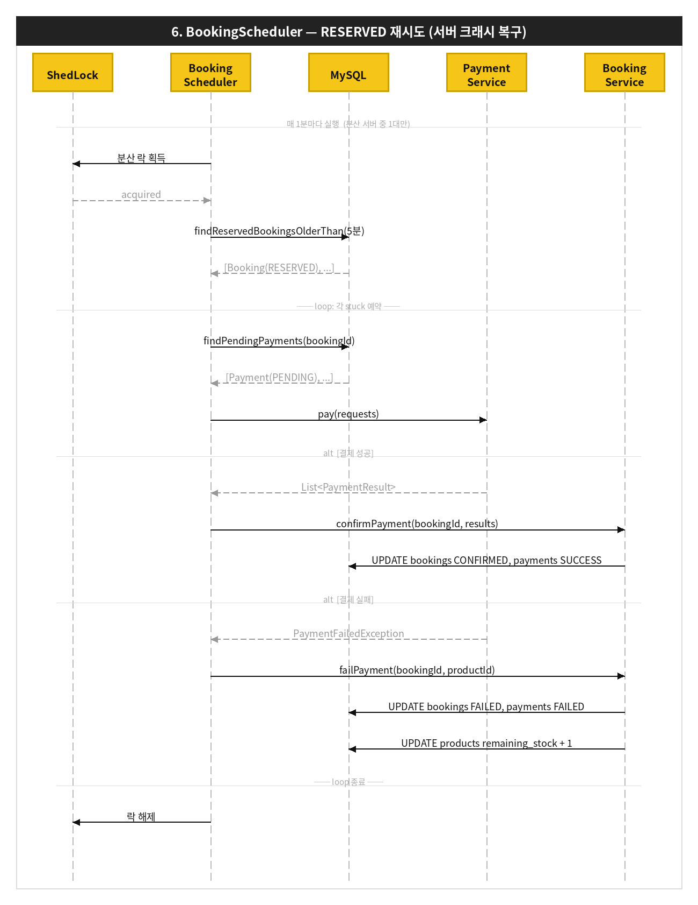

# 선착순 예약 시스템

특정 시간(00시)에 오픈되는 한정 수량 숙소 상품에 대한 선착순 예약/결제 플랫폼입니다.

---

## 목차

1. [기술 스택](#기술-스택)
2. [시스템 아키텍처](#시스템-아키텍처)
3. [패키지 구조](#패키지-구조)
4. [실행 방법](#실행-방법)
5. [API 목록](#api-목록)
6. [시퀀스 다이어그램](#시퀀스-다이어그램)
7. [ERD](#erd)
8. [DDL](#ddl)

---

## 기술 스택

| 분류 | 기술 |
|------|------|
| Language | Java 17 |
| Framework | Spring Boot 3.1.9 |
| ORM | Spring Data JPA (Hibernate) |
| DB Migration | Flyway |
| RDB | MySQL 8.0 |
| Cache / Lock | Redis 7 (Redisson) |
| Circuit Breaker | Resilience4j |
| Distributed Scheduler | ShedLock (JDBC provider) |
| Build | Gradle |

---

## 시스템 아키텍처

```
                   ┌──────────────────────────────────────────┐
                   │           Load Balancer                  │
                   └──────────────┬───────────────────────────┘
                                  │
               ┌──────────────────┴──────────────────┐
               │                                     │
    ┌──────────▼──────────┐             ┌────────────▼──────────┐
    │   App Server 1      │             │   App Server 2        │
    │  (Spring Boot)      │             │  (Spring Boot)        │
    └──────────┬──────────┘             └────────────┬──────────┘
               │                                     │
               └──────────────┬──────────────────────┘
                              │
          ┌───────────────────┼───────────────────┐
          │                   │                   │
 ┌────────▼────────┐ ┌────────▼────────┐          │
 │   MySQL 8.0     │ │   Redis 7       │          │
 │                 │ │                 │          │
 │ - 재고 원본       │ │ - 재고 빠른       │           │
 │   (source of    │ │   거부 게이트      │          │
 │    truth)       │ │ - 분산 락         │          │
 │ - 예약/결제       │ │   (Redisson)    │          │
 │   영속화          │ │                 │          │
 │ - ShedLock      │ └─────────────────┘          │
 └─────────────────┘                              │
                                      ┌──────────▼──────────┐
                                      │  Mock Payment GW    │
                                      │  (외부 PG 연동 구조) │
                                      └─────────────────────┘
```

### 레이어드 아키텍처 — implement 계층

Spring의 `@Service`는 DDD(Domain-Driven Design)에서 정의한 **"비즈니스 서비스의 파사드"** 개념을 기반으로 합니다. 서비스 코드에는 세부 구현이 드러나는 것이 아니라, **비즈니스 흐름 자체가 읽혀야** 합니다.

이상적인 서비스 코드의 형태:

```java
Something doSomething() {
    Something something = somethingFinder.find(); // 1. 필요한 도메인을 찾는다
    something.do();                               // 2. 도메인에게 일을 시킨다
    somethingWriter.write(something);             // 3. 변경사항을 저장한다
    return something;                             // 4. 결과를 반환한다
}
```

서비스가 Repository를 직접 호출하고 검증 로직까지 담으면, 코드를 읽는 사람은 비즈니스 흐름과 구현 세부사항을 동시에 파악해야 합니다. `implement` 계층은 이 **구현 세부사항을 캡슐화**하기 위해 도입했습니다.

**계층별 역할:**

| 계층 | 역할 | 예시 |
|------|------|------|
| `service` | 비즈니스 흐름 오케스트레이션 | `BookingService`, `PaymentService` |
| `implement/Finder` | 도메인 조회 | `BookingFinder`, `PaymentFinder` |
| `implement/Writer` | 도메인 저장/수정 | `BookingWriter`, `PaymentWriter` |
| `implement/Validator` | 비즈니스 규칙 검증 | `PaymentValidator` |
| `implement/Processor` | 복합적인 처리 단위 | `InventoryProcessor` |

**적용 결과** — 서비스 레이어에서 비즈니스 흐름이 그대로 읽힙니다:

```java
// BookingProcessor.process()
bookingFinder.findByIdempotencyKey(key);   // 중복 요청 확인
paymentValidator.validateAmount(...);       // 결제 금액 검증
inventoryProcessor.decrementStock(...);     // 재고 차감
bookingWriter.saveBooking(...);             // 예약 저장
```

Redis Lua Script 실행, DB 쿼리, 예외 처리 등 구현 세부사항은 `implement` 계층 내부에 캡슐화되어 서비스 레이어에 노출되지 않습니다.

---

## 패키지 구조

```
src/main/java/com/reservation/
├── api/
│   ├── controller/          # REST 컨트롤러
│   ├── dto/                 # 요청/응답 DTO
│   └── exception/           # 커스텀 예외 + GlobalExceptionHandler
├── config/                  # Redis Script, ShedLock 설정
├── domain/
│   ├── booking/             # Booking 엔티티, BookingStatus
│   ├── payment/             # Payment 엔티티, PaymentMethod, PaymentStatus
│   ├── product/             # Product 엔티티
│   └── user/                # User 엔티티
├── event/                   # 도메인 이벤트 및 핸들러
├── implement/
│   ├── booking/             # BookingFinder, BookingWriter, BookingValidator
│   ├── inventory/           # InventoryProcessor, InventoryPreWarmer
│   └── payment/             # PaymentFinder, PaymentWriter, PaymentValidator
├── infrastructure/
│   └── persistence/         # JPA Repository
└── service/
    ├── booking/             # BookingService, BookingProcessor, BookingScheduler
    ├── checkout/            # CheckoutService
    └── payment/             # PaymentService, Chargeable 전략들, MockPaymentGateway
```

---

## 실행 방법

### 사전 요구사항

- Java 17+
- Docker & Docker Compose

### 1. 인프라 실행

```bash
docker compose up -d
```

MySQL(`localhost:3306`)과 Redis(`localhost:6379`)가 실행됩니다.
Flyway가 애플리케이션 시작 시 스키마 및 시드 데이터를 자동으로 적용합니다.

### 2. 애플리케이션 실행

```bash
./gradlew bootRun
```

서버가 `http://localhost:8080`에서 실행됩니다.

### 3. 동작 확인

시드 데이터로 아래 상품과 유저가 생성됩니다.

| productId | 상품명 | 가격 | 재고 |
|-----------|--------|------|------|
| 1 | 서울 프리미엄 호텔 디럭스룸 | 150,000원 | 10 |
| 2 | 제주 오션뷰 리조트 | 200,000원 | 5 |
| 3 | 부산 해운대 비치호텔 | 120,000원 | 3 |

| userId | username |
|--------|----------|
| 1 | user1 |
| 2 | user2 |
| 3 | user3 |

**주문서 조회**
```bash
curl "http://localhost:8080/checkout?productId=1"
```

**예약/결제 (단일 결제)**
```bash
curl -X POST http://localhost:8080/booking \
  -H "Content-Type: application/json" \
  -d '{
    "userId": 1,
    "productId": 1,
    "idempotencyKey": "unique-request-id-001",
    "paymentRequests": [
      { "type": "CREDIT_CARD", "amount": 150000 }
    ]
  }'
```

**예약/결제 (복합 결제)**
```bash
curl -X POST http://localhost:8080/booking \
  -H "Content-Type: application/json" \
  -d '{
    "userId": 2,
    "productId": 1,
    "idempotencyKey": "unique-request-id-002",
    "paymentRequests": [
      { "type": "Y_POINT", "amount": 50000 },
      { "type": "CREDIT_CARD", "amount": 100000 }
    ]
  }'
```

---

## API 목록

### GET /checkout

주문서 진입 API. 상품 정보를 조회합니다.

**Query Parameter**

| 파라미터 | 타입 | 필수 | 설명 |
|---------|------|------|------|
| productId | Long | Y | 조회할 상품 ID |

**Response 200**

```json
{
  "productId": 1,
  "name": "서울 프리미엄 호텔 디럭스룸",
  "price": 150000,
  "checkInDate": "2026-05-01",
  "checkOutDate": "2026-05-02",
  "remainingStock": 10
}
```

---

### POST /booking

결제 및 예약 완료 API. 결제를 진행하고 예약을 생성합니다.

**Request Body**

```json
{
  "userId": 1,
  "productId": 1,
  "idempotencyKey": "클라이언트가 생성한 고유 키",
  "paymentRequests": [
    { "type": "CREDIT_CARD", "amount": 150000 }
  ]
}
```

| 필드 | 타입 | 필수 | 설명 |
|------|------|------|------|
| userId | Long | Y | 예약 유저 ID |
| productId | Long | Y | 예약 상품 ID |
| idempotencyKey | String | Y | 중복 요청 방지용 고유 키 |
| paymentRequests | Array | Y | 결제 수단 목록 (1개 이상) |
| paymentRequests[].type | Enum | Y | `CREDIT_CARD` / `Y_PAY` / `Y_POINT` |
| paymentRequests[].amount | Long | Y | 결제 금액 (양수) |

**결제 조합 규칙**
- `CREDIT_CARD + Y_POINT` 복합 결제 가능
- `Y_PAY + Y_POINT` 복합 결제 가능
- `CREDIT_CARD + Y_PAY` 혼용 불가
- `paymentRequests` 금액 합계 = 상품 가격이어야 함

**Response 200**

```json
{
  "bookingId": 1,
  "status": "CONFIRMED",
  "totalAmount": 150000,
  "createdAt": "2026-05-01T00:00:01.123456"
}
```

**Error Responses**

| HTTP Status | 상황 |
|-------------|------|
| 400 | 결제 금액 합계 불일치, 요청 값 유효성 오류 |
| 404 | 존재하지 않는 유저/상품 |
| 409 | 재고 소진, 중복 요청 처리 중 |
| 503 | 락 획득 중 인터럽트 발생 |

---


## 시퀀스 다이어그램

### Checkout (주문서 조회)

---

### Booking (예약/결제) — 정상 흐름


---

### Booking — 재고 소진


---

### Booking — 결제 실패 (보상 트랜잭션)


---

### Booking — 멱등성 (중복 요청)


---

### BookingScheduler — RESERVED 재시도 (서버 크래시 복구)


---

## ERD

```
┌─────────────────────────────────────┐
│               users                 │
├─────────────┬───────────────────────┤
│ id          │ BIGINT PK AUTO_INC    │
│ username    │ VARCHAR(100) NOT NULL │
│ email       │ VARCHAR(255) UNIQUE   │
│ created_at  │ DATETIME(6)           │
│ updated_at  │ DATETIME(6)           │
└─────────────┴───────────────────────┘

┌─────────────────────────────────────────┐
│               products                  │
├─────────────────┬───────────────────────┤
│ id              │ BIGINT PK AUTO_INC    │
│ name            │ VARCHAR(255)          │
│ price           │ BIGINT                │
│ check_in_date   │ DATE                  │
│ check_out_date  │ DATE                  │
│ total_inventory │ INT                   │
│ remaining_stock │ INT CHECK(>= 0)       │
│ created_at      │ DATETIME(6)           │
│ updated_at      │ DATETIME(6)           │
└─────────────────┴───────────────────────┘

┌───────────────────────────────────────────────────────┐
│                       bookings                        │
├─────────────────────┬─────────────────────────────────┤
│ id                  │ BIGINT PK AUTO_INC              │
│ user_id             │ BIGINT FK → users.id            │
│ product_id          │ BIGINT FK → products.id         │
│ status              │ VARCHAR(30) DEFAULT 'RESERVED'  │
│ idempotency_key     │ VARCHAR(64) UNIQUE              │
│ total_amount        │ BIGINT                          │
│ payment_retry_count │ INT DEFAULT 0                   │
│ created_at          │ DATETIME(6)                     │
│ updated_at          │ DATETIME(6)                     │
└─────────────────────┴─────────────────────────────────┘

┌──────────────────────────────────────────────────────┐
│                      payments                        │
├───────────────────┬──────────────────────────────────┤
│ id                │ BIGINT PK AUTO_INC               │
│ booking_id        │ BIGINT FK → bookings.id          │
│ payment_method    │ VARCHAR(30)                      │
│ amount            │ BIGINT                           │
│ status            │ VARCHAR(30) DEFAULT 'PENDING'    │
│ pg_transaction_id │ VARCHAR(255) NULL                │
│ created_at        │ DATETIME(6)                      │
│ updated_at        │ DATETIME(6)                      │
└───────────────────┴──────────────────────────────────┘

┌──────────────────────────────────────┐
│              shedlock                │
├────────────┬─────────────────────────┤
│ name       │ VARCHAR(64) PK          │
│ lock_until │ TIMESTAMP(3)            │
│ locked_at  │ TIMESTAMP(3)            │
│ locked_by  │ VARCHAR(255)            │
└────────────┴─────────────────────────┘
```

**관계**
- `users` 1 : N `bookings`
- `products` 1 : N `bookings`
- `bookings` 1 : N `payments`

**Booking Status**

| 상태 | 의미 |
|------|------|
| RESERVED | 재고 차감 완료, 결제 대기 중 |
| CONFIRMED | 결제 성공, 예약 확정 |
| FAILED | 결제 실패, 재고 복구 완료 |

**Payment Status**

| 상태 | 의미 |
|------|------|
| PENDING | 결제 요청 저장, 처리 대기 중 |
| SUCCESS | 결제 성공 |
| FAILED | 결제 실패 |

---

## DDL

```sql
CREATE TABLE users (
    id         BIGINT       NOT NULL AUTO_INCREMENT,
    username   VARCHAR(100) NOT NULL,
    email      VARCHAR(255) NOT NULL,
    created_at DATETIME(6)  NOT NULL DEFAULT CURRENT_TIMESTAMP(6),
    updated_at DATETIME(6)  NOT NULL DEFAULT CURRENT_TIMESTAMP(6) ON UPDATE CURRENT_TIMESTAMP(6),
    PRIMARY KEY (id),
    UNIQUE KEY uk_users_email (email)
) ENGINE=InnoDB DEFAULT CHARSET=utf8mb4 COLLATE=utf8mb4_unicode_ci;

CREATE TABLE products (
    id               BIGINT       NOT NULL AUTO_INCREMENT,
    name             VARCHAR(255) NOT NULL,
    price            BIGINT       NOT NULL,
    check_in_date    DATE         NOT NULL,
    check_out_date   DATE         NOT NULL,
    total_inventory  INT          NOT NULL DEFAULT 0,
    remaining_stock  INT          NOT NULL DEFAULT 0,
    created_at       DATETIME(6)  NOT NULL DEFAULT CURRENT_TIMESTAMP(6),
    updated_at       DATETIME(6)  NOT NULL DEFAULT CURRENT_TIMESTAMP(6) ON UPDATE CURRENT_TIMESTAMP(6),
    PRIMARY KEY (id),
    CONSTRAINT chk_stock_non_negative CHECK (remaining_stock >= 0),
    CONSTRAINT chk_stock_not_exceed   CHECK (remaining_stock <= total_inventory)
) ENGINE=InnoDB DEFAULT CHARSET=utf8mb4 COLLATE=utf8mb4_unicode_ci;

CREATE TABLE bookings (
    id                   BIGINT      NOT NULL AUTO_INCREMENT,
    user_id              BIGINT      NOT NULL,
    product_id           BIGINT      NOT NULL,
    status               VARCHAR(30) NOT NULL DEFAULT 'RESERVED',
    idempotency_key      VARCHAR(64) NOT NULL,
    total_amount         BIGINT      NOT NULL,
    payment_retry_count  INT         NOT NULL DEFAULT 0,
    created_at           DATETIME(6) NOT NULL DEFAULT CURRENT_TIMESTAMP(6),
    updated_at           DATETIME(6) NOT NULL DEFAULT CURRENT_TIMESTAMP(6) ON UPDATE CURRENT_TIMESTAMP(6),
    PRIMARY KEY (id),
    UNIQUE KEY uk_bookings_idempotency_key (idempotency_key),
    CONSTRAINT fk_bookings_user    FOREIGN KEY (user_id)    REFERENCES users(id),
    CONSTRAINT fk_bookings_product FOREIGN KEY (product_id) REFERENCES products(id)
) ENGINE=InnoDB DEFAULT CHARSET=utf8mb4 COLLATE=utf8mb4_unicode_ci;

CREATE TABLE payments (
    id                BIGINT       NOT NULL AUTO_INCREMENT,
    booking_id        BIGINT       NOT NULL,
    payment_method    VARCHAR(30)  NOT NULL,
    amount            BIGINT       NOT NULL,
    status            VARCHAR(30)  NOT NULL DEFAULT 'PENDING',
    pg_transaction_id VARCHAR(255),
    created_at        DATETIME(6)  NOT NULL DEFAULT CURRENT_TIMESTAMP(6),
    updated_at        DATETIME(6)  NOT NULL DEFAULT CURRENT_TIMESTAMP(6) ON UPDATE CURRENT_TIMESTAMP(6),
    PRIMARY KEY (id),
    CONSTRAINT fk_payments_booking FOREIGN KEY (booking_id) REFERENCES bookings(id)
) ENGINE=InnoDB DEFAULT CHARSET=utf8mb4 COLLATE=utf8mb4_unicode_ci;

CREATE TABLE shedlock (
    name       VARCHAR(64)  NOT NULL,
    lock_until TIMESTAMP(3) NOT NULL,
    locked_at  TIMESTAMP(3) NOT NULL DEFAULT CURRENT_TIMESTAMP(3),
    locked_by  VARCHAR(255) NOT NULL,
    PRIMARY KEY (name)
) ENGINE=InnoDB DEFAULT CHARSET=utf8mb4 COLLATE=utf8mb4_unicode_ci;

CREATE INDEX idx_bookings_user_id    ON bookings (user_id);
CREATE INDEX idx_bookings_product_id ON bookings (product_id);
CREATE INDEX idx_bookings_status     ON bookings (status);
CREATE INDEX idx_payments_booking_id ON payments (booking_id);
```
